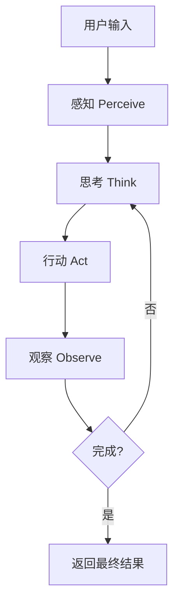
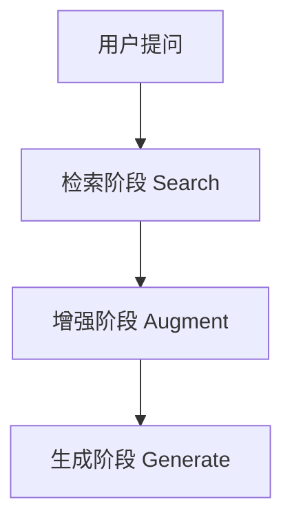
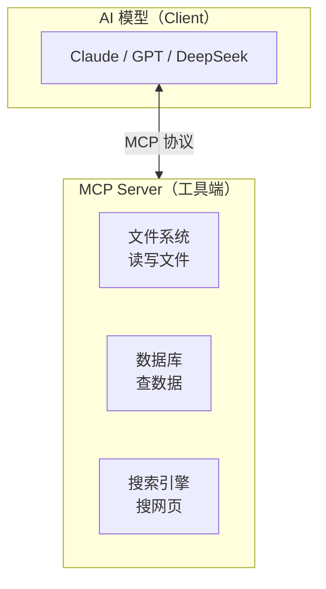
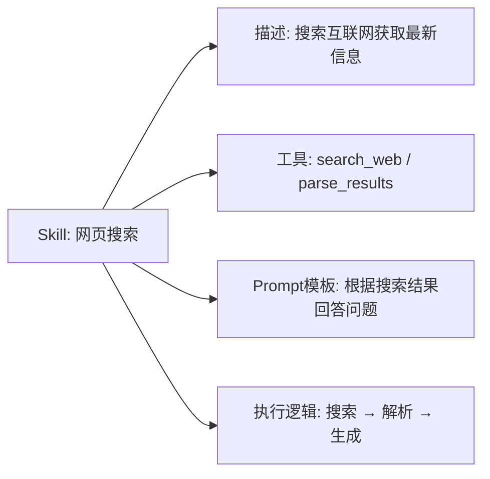
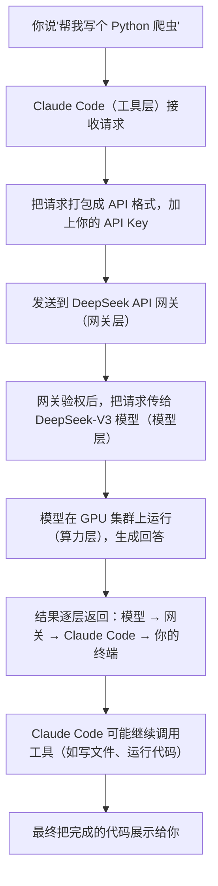

# AI 开发核心概念科普：模型、API 与 Agent

## 前言：为什么需要了解这些概念

很多人跟着教程配好了 Claude Code，能跑起来写代码，但一遇到问题就抓瞎：

- 报错 401，不知道是 API Key 错了还是 Base URL 错了
- 模型输出不稳定，不知道"温度参数"能调
- 想换一家模型提供商，不知道 OpenAI 兼容格式是什么意思
- 听说 Agent 很火，但搞不清它和普通聊天机器人到底差在哪

这些问题背后，其实是对几个核心概念没建立认知：**大模型是什么、API 怎么工作、Agent 能做什么、Token 怎么计费、上下文窗口是什么**。这篇就用最通俗的类比，把这些概念一次性讲清楚。

读完这篇，你能回答三个问题：**我在用什么、它怎么工作、出问题怎么定位**。

## 一、大模型基础概念

### 1.1 什么是大模型

想象有一个超级读者，读过互联网上几乎所有公开的文字——书、论文、代码、论坛帖子、新闻。它从这些文字里总结出了语言的规律：什么词后面大概率跟什么词，怎么组织句子才通顺，怎么回答才算合理。

**大模型（Large Language Model，LLM）** 就是这样一个"数字大脑"。它不是真的"理解"了世界，而是通过海量数据训练，学会了**预测下一个词**的能力。当你问它问题时，它其实是在根据你的问题，一个字一个字地"猜"出最合理的回答。

关键数字：
- **参数规模**：从几十亿（7B）到几千亿（400B+）不等，参数越多，模型越能处理复杂任务
- **训练数据**：通常包含数万亿个词（token）的文本
- **训练成本**：大模型训练一次需要数千张 GPU 运行数周，成本数百万到数千万美元

### 1.2 模型参数是什么

类比：**参数就像大脑里的神经元连接数量**。

人脑有约 860 亿个神经元，每个神经元和成千上万个其他神经元相连。连接的强弱决定了你记得住什么、反应有多快。

大模型的参数也是类似的"连接权重"。训练过程就是在调整这些权重：猜对了就加强这条连接，猜错了就削弱。最终，数千亿个参数共同编码了模型从数据中学到的所有"知识"。

常见规模对照：

| 规模 | 参数量 | 类比 |
|------|--------|------|
| 小模型 | 7B（70亿） | 一本厚书的容量 |
| 中模型 | 70B（700亿） | 一个小型图书馆 |
| 大模型 | 400B+（4000亿+） | 大型图书馆的藏书量 |

> ⚠️ 参数多 ≠ 一定更好。训练质量、数据质量、架构设计同样重要。一个训练精良的 70B 模型，可能比粗制滥造的 200B 模型更实用。

### 1.3 训练 vs 推理

类比：
- **训练 = 学骑自行车**：摔了很多次，慢慢找到平衡感，调整身体各部位的配合
- **推理 = 骑车上路**：用学好的技能应对新的路况，遇到坑知道躲，遇到坡知道加速

| | 训练（Training） | 推理（Inference） |
|---|---|---|
| 目的 | 让模型学会规律 | 用学好的模型回答问题 |
| 过程 | 大量数据输入 → 预测 → 对比正确答案 → 调整参数 | 输入问题 → 模型计算 → 输出回答 |
| 成本 | 极高（数百万美元级） | 低（按调用次数和 token 量计费） |
| 谁在做 | 大厂、研究机构 | 普通开发者、用户 |
| 时间 | 数周到数月 | 毫秒到秒级 |

**普通用户只接触推理**。训练是大厂的事，你买的 API 服务，本质上就是买"推理调用权"。

### 1.4 模型能力边界

大模型很强大，但不是万能的。清楚它的边界，才能用对地方。

**能做什么：**
- 文本生成：写文章、写邮件、写代码
- 问答对话：解释概念、回答问题、头脑风暴
- 翻译总结：跨语言翻译、长文摘要
- 代码辅助：写函数、改 Bug、解释代码逻辑

**不能做什么：**
- **实时联网**：模型本身不联网，知识截止到训练数据的时间点（除非配了搜索工具）
- **精确计算**：大模型是"概率生成器"，不是计算器。三位数乘法它可能算错，而且错得很自信
- **访问你的私有数据**：除非你主动把数据发给它
- **保证事实准确**：会"幻觉"（Hallucination）——编造假信息但说得像真的一样

> 💡 **关键认知**：大模型是"概率生成器"，不是"真理机器"。它的回答是"看起来最合理的"，不是"绝对正确的"。涉及事实、数据、代码时，务必人工验证。

## 二、API 基础概念

### 2.1 什么是 API

类比：**API 就像餐厅的点餐系统**。

你去餐厅吃饭，不需要进厨房自己炒菜。你看菜单（接口说明），告诉服务员要什么（发送请求），服务员把话传给厨房（后端处理），再把做好的菜端给你（返回结果）。

**API（Application Programming Interface，应用程序接口）** 就是程序之间的"服务员"。它规定了一套"对话规则"：
- 怎么发起请求（说什么）
- 请求里要包含什么信息（点哪道菜、几份、什么口味）
- 返回的结果长什么样（菜做好了、卖完了、还是厨房着火了）

为什么要用 API？
- **不用了解内部**：你不需要知道模型是怎么训练的，按格式发请求就能用
- **标准化**：所有调用者用同一套规则，降低对接成本
- **可替换**：今天接 DeepSeek，明天接讯飞，接口格式一样，换起来成本低

### 2.2 API Key 与 Base URL

继续餐厅类比：

| 概念 | 类比 | 作用 |
|------|------|------|
| **API Key** | 会员卡 | 证明你有权限调用，用于身份认证和计费 |
| **Base URL** | 餐厅地址 | 告诉请求发到哪里，不同提供商地址不同 |
| **Endpoint** | 具体窗口 | 不同功能走不同路径，如 `/chat/completions` |

实际例子：
```
Base URL: https://api.deepseek.com
API Key: sk-xxxxxxxxxxxxxxxx
```

每次调用时，你的程序会把 API Key 放进请求头里，就像刷卡时出示会员卡。提供商收到后，先验卡（Key 是否有效、余额是否充足），再处理请求。

### 2.3 请求与响应格式

API 通信通常用 **JSON** 格式——一种人和机器都能读的结构化文本。

**请求示例**（问模型"你好"）：
```json
{
  "model": "deepseek-chat",
  "messages": [
    {"role": "user", "content": "你好"}
  ],
  "temperature": 0.7
}
```

**响应示例**：
```json
{
  "choices": [
    {
      "message": {
        "role": "assistant",
        "content": "你好！很高兴见到你。"
      }
    }
  ],
  "usage": {
    "prompt_tokens": 2,
    "completion_tokens": 8,
    "total_tokens": 10
  }
}
```

关键字段：
- `model`：指定用哪个模型
- `messages`：对话历史，包含用户和模型的发言
- `temperature`：创造力参数（后面会讲）
- `usage`：计费信息，告诉你这次调用消耗了多少 token

### 2.4 OpenAI 兼容格式

OpenAI 的 API 设计成了行业事实标准。后来出现的国产模型提供商（DeepSeek、讯飞、硅基流动等），为了降低用户的迁移成本，都采用了**兼容 OpenAI 格式**的接口。

这意味着：
- 你用 Claude Code 接 DeepSeek，和接 OpenAI 的代码几乎一样
- 换提供商时，通常只需要改 Base URL 和 API Key
- 工具开发者（如 Claude Code）只需要支持一种格式，就能接多家模型

> 💡 这就是为什么说 Claude Code 能"无缝接入国产模型"——底层格式已经统一了，区别只在于地址和密钥。

## 三、Agent 概念

### 3.1 什么是 AI Agent

类比：
- **普通 Chatbot** = 问答机器人：你问"北京天气怎么样"，它回答"今天晴，25度"
- **AI Agent** = 能动手办事的助手：你说"帮我查北京天气，如果下雨就提醒我带伞，顺便订个附近的咖啡馆"，它会——查天气 API → 判断是否需要提醒 → 搜索附近咖啡馆 → 给出推荐

**Agent 的核心特征**：不只是"说话"，还能**调用工具、执行操作、多步骤完成任务**。

### 3.2 Agent vs 普通 Chatbot

| | 普通 Chatbot | AI Agent |
|---|---|---|
| 交互模式 | 一问一答 | 多轮协作，主动推进 |
| 能力范围 | 只生成文本 | 生成文本 + 调用工具 + 执行操作 |
| 任务完成 | 单次回答即结束 | 可分解任务、循环执行直到完成 |
| 例子 | "解释什么是 Python" | "帮我写一个 Python 脚本，测试它，修改 Bug，然后提交到 Git" |

### 3.3 Agent 的工作流

Agent 的工作遵循一个循环：**感知 → 思考 → 行动 → 观察 → 再思考……**



### 3.4 Tool Use（工具调用）

模型本身被关在"黑盒"里，不能直接操作你的电脑。但它可以**生成调用指令**，让外部程序去执行。

流程：
1. 模型分析任务，判断需要用什么工具
2. 模型生成一段"工具调用指令"（如：`{"tool": "read_file", "path": "/etc/hosts"}`）
3. 外部程序收到指令，执行实际操作
4. 执行结果返回给模型
5. 模型基于结果继续下一步

Claude Code 就是一个典型的 Agent：
- 它能**读文件**（`Read` 工具）
- 能**改代码**（`Edit` 工具）
- 能**运行命令**（`Bash` 工具）
- 能**搜索代码**（`Grep` 工具）

你说"帮我给这个项目加个登录功能"，Claude Code 会——读现有代码 → 分析架构 → 写登录逻辑 → 测试运行 → 告诉你结果。

### 3.5 RAG（检索增强生成）

类比：**RAG 就像考试前翻参考书**。

大模型的知识截止到训练数据的时间点，遇到新问题、新文档、私有数据就抓瞎了。RAG 的思路是：**先检索相关信息，再让模型基于检索到的内容生成回答**。

**工作流程**：



**为什么用 RAG**：
- **解决知识时效性问题**：模型不知道最新信息？查完再答
- **引入私有数据**：企业文档、个人笔记、产品手册都能作为知识源
- **减少幻觉**：回答基于真实检索到的资料，不是模型瞎编
- **可溯源**：能告诉用户"这个回答来自哪篇文档的哪一段"

**典型应用场景**：
- 企业知识库问答（客服机器人、内部文档助手）
- 代码库智能搜索（基于项目代码回答问题）
- 个人笔记助手（基于 Obsidian/Notion 笔记回答问题）

### 3.6 LangChain

类比：**LangChain 就像乐高积木的说明书和连接件**。

开发 AI 应用时，你需要把很多功能拼在一起：调用模型、管理对话历史、接入搜索引擎、读写数据库、处理文档……LangChain 提供了一套标准化的"连接件"和"说明书"，让你能快速搭建复杂的 AI 工作流。

**核心组件**：

| 组件 | 作用 | 类比 |
|------|------|------|
| **Chains** | 把多个步骤串成流水线 | 工厂流水线 |
| **Prompt Templates** | 管理 prompt 模板，支持变量填充 | 填空题模板 |
| **Document Loaders** | 读取各种格式的文档（PDF、Word、网页） | 文件读取器 |
| **Text Splitters** | 把长文档切成适合模型处理的片段 | 切菜板 |
| **Vector Stores** | 存储和检索向量化的文档片段 | 索引卡片盒 |
| **Agents** | 让模型自主决定调用什么工具 | 智能调度员 |

**简单示例**：

```python
from langchain import OpenAI, LLMChain, PromptTemplate

# 定义一个 prompt 模板
template = """根据以下上下文回答问题：
上下文：{context}
问题：{question}
回答："""
prompt = PromptTemplate(template=template, input_variables=["context", "question"])

# 把模板和模型串成一条链
llm = OpenAI()
chain = LLMChain(llm=llm, prompt=prompt)

# 运行
result = chain.run(context="北京今天晴天", question="今天适合出门吗？")
```

**LangChain 的价值**：
- **降低开发门槛**：不用从零写 RAG、Agent 等复杂逻辑
- **生态丰富**：支持几乎所有主流模型和数据库
- **可扩展**：自定义组件，适配特定业务场景

> ⚠️ LangChain 是工具，不是银弹。简单场景直接调 API 更轻量，复杂场景才需要上 LangChain。

### 3.7 MCP（Model Context Protocol）

类比：**MCP 就像 USB-C 接口——统一了 AI 模型和外部工具之间的连接标准**。

在 MCP 出现之前，每个 AI 工具都要单独适配每个外部服务（搜索引擎、数据库、文件系统……），就像每部手机都要配一个专属充电器。MCP 定义了一套通用协议，让任何支持 MCP 的模型都能和任何支持 MCP 的工具对接。

**核心思想**：
- **标准化接口**：定义模型和工具之间如何"对话"
- **一次接入，处处可用**：工具开发者只需实现 MCP 协议，就能被所有 MCP 兼容的模型使用
- **双向通信**：模型不仅能调用工具，工具也能主动给模型推送上下文

**MCP 的组成**：



**为什么重要**：
- **降低集成成本**：工具开发者只写一次 MCP Server，所有模型都能用
- **提升互操作性**：不同厂商的模型和工具能无缝协作
- **推动生态繁荣**：类似 HTTP 协议统一了网页，MCP 可能统一 AI 工具接口

**实际例子**：Claude Code 的 `CLAUDE.md` 文件本质上就是一种 MCP 的实现——它定义了模型如何获取项目上下文。

### 3.8 Skills（技能系统）

类比：**Skills 就像游戏里的"技能树"——模型通过加载不同的技能包，获得不同的能力**。

在 AI Agent 开发中，"Skill" 指的是**可复用的功能模块**。一个 Skill 封装了完成某类任务所需的全部能力：工具调用、prompt 模板、执行逻辑等。

**Skill 的组成**：



**Skills  vs 普通工具的区别**：

| | 普通工具 | Skills |
|---|---|---|
| 粒度 | 单一功能（如搜索） | 完整工作流（搜索+分析+生成） |
| 复用性 | 低，通常硬编码在应用里 | 高，可独立发布和加载 |
| 配置方式 | 代码写死 | 声明式配置（JSON/YAML） |
| 动态加载 | 难 | 运行时动态加载、卸载 |

**典型 Skill 示例**：
- **Code Review Skill**：自动分析代码变更，生成审查报告
- **Documentation Skill**：读取代码，自动生成文档
- **Testing Skill**：分析代码，生成测试用例并执行

**在 Claude Code 中**：Skills 通过 `CLAUDE.md` 和项目配置来定义。你可以在 `CLAUDE.md` 里声明项目特有的 Skill，让 Claude Code 在处理这个项目时自动加载。

### 3.9 Hermes（消息协议）

类比：**Hermes 就像 AI 世界的"快递单格式标准"——规定了模型和工具之间传递消息的格式**。

Hermes 是一个开源的**消息协议规范**，定义了 AI Agent 系统中各个组件之间如何通信。它关注的是"消息长什么样"，而不是"消息怎么传"。

**核心设计**：
- **消息结构化**：所有交互都封装成标准化的消息对象
- **角色区分**：明确区分 `user`（用户）、`assistant`（模型）、`system`（系统）、`tool`（工具）等角色
- **工具调用标准化**：定义模型如何请求调用工具、工具如何返回结果

**消息格式示例**：

```json
{
  "role": "assistant",
  "content": "我来帮你查一下天气",
  "tool_calls": [
    {
      "id": "call_123",
      "type": "function",
      "function": {
        "name": "get_weather",
        "arguments": "{\"city\": \"北京\"}"
      }
    }
  ]
}
```

**Hermes 的定位**：
- 它是**协议层**的规范，类似 HTTP 定义了请求/响应格式
- 和 MCP 的关系：MCP 是更高层的"应用协议"，Hermes 是底层的"消息格式"
- 和 LangChain 的关系：LangChain 是框架，Hermes 是协议，两者可以配合使用

**为什么需要标准化消息协议**：
- 不同模型（GPT、Claude、DeepSeek）的输出格式不同，需要统一转换
- 工具调用、多轮对话、上下文管理都需要标准化的消息结构
- 标准化后，Agent 框架可以更容易地适配不同模型

## 四、使用中的关键概念

### 4.1 Token 是什么

类比：**Token 是文字的"碎片"**。

模型不直接读"字"，而是把文字切成碎片（token），每个碎片对应一个数字编号。模型处理的是这些数字，不是原始文字。

**切分规则**：
- 英文：按单词或子词切。`"hello"` → 1 个 token；`"unbelievable"` → 可能切成 `un` + `believ` + `able` 多个 token
- 中文：通常按字切。`"你好世界"` → 4 个 token（你/好/世/界）

**经验值**：
- 1 个汉字 ≈ 1~2 token
- 1 个英文单词 ≈ 1~1.5 token
- 1000 token ≈ 750 个英文单词 ≈ 400~500 个汉字

**为什么重要**：
- **计费单位**：API 按 token 数量收费（输入 + 输出分别计）
- **长度限制**：模型的上下文窗口以 token 为单位计量
- **优化技巧**：写 prompt 时精简表达，能减少 token 消耗、降低成本

### 4.2 上下文窗口（Context Window）

类比：**模型的"短期记忆力"**。

人一次能记住多少信息是有限的。模型也一样——它一次能处理的 token 数量有上限，这个上限就叫**上下文窗口**。

常见窗口大小：

| 窗口大小 | 能容纳的内容 | 适用场景 |
|----------|-------------|---------|
| 4K（4096） | 几页纸 | 简单问答、短对话 |
| 128K（131072） | 一本中篇小说 | 长文档分析、代码库理解 |
| 200K+ | 一部长篇小说 | 整本书分析、大型项目梳理 |

**重要认知**：
- 上下文窗口 = 输入 + 输出 的总和，不是只看输入
- 窗口越大，模型一次能"记住"的信息越多，长文档分析能力越强
- 超出窗口的内容会被截断或遗忘

### 4.3 温度参数（Temperature）

类比：**创造力的"旋钮"**。

温度参数控制模型输出的"随机性"，范围通常是 0 ~ 2（最常用 0 ~ 1）。

| 温度值 | 效果 | 适用场景 |
|--------|------|---------|
| 0 ~ 0.3 | 保守、确定性强、几乎固定回答 | 代码生成、事实问答、数学计算 |
| 0.5 ~ 0.7 | 平衡，有一定变化但不离谱 | 一般对话、邮件撰写 |
| 0.8 ~ 1.0 | 创意多、随机性强、每次回答不同 | 头脑风暴、创意写作、故事生成 |

**原理简述**：温度影响模型选词时的"胆量"。低温时，模型总是选概率最高的词，回答稳定但可能死板；高温时，模型愿意尝试概率较低的词，回答多样但可能离谱。

### 4.4 系统提示词（System Prompt）

类比：**给模型的"角色设定"或"工作手册"**。

系统提示词是在对话开始前植入的一段指令，定义了模型的行为方式。用户通常看不到它，但它深刻影响每一次输出。

**示例对比**：

系统提示词 A：`"你是一个严谨的代码审查员，只关注代码质量和安全性问题。"`
→ 用户问"这段代码怎么样"，模型会挑 Bug、提优化建议

系统提示词 B：`"你是一个幽默的聊天伙伴，用轻松的语言回答问题。"`
→ 同样的问题，模型可能会开玩笑、用比喻解释

**为什么重要**：
- 系统提示词是"隐形的方向盘"，决定了模型的语气、风格和边界
- Claude Code 的 `CLAUDE.md` 本质上就是一个系统提示词文件
- 好的系统提示词能让模型在特定场景下表现大幅提升

## 五、生态位置关系：一张图讲清你在用什么

理解了上面的概念，现在把它们放到一张图里，看清各层之间的关系。


### 五层架构详解

**第 1 层：用户层**
- 你通过各种界面使用 AI：Claude Code（终端）、ChatGPT（网页）、Kimi App（手机）
- 这一层只管交互，不管模型怎么跑

**第 2 层：应用/工具层**
- Claude Code、ChatGPT、各类 AI 应用
- 负责：界面交互、Agent 编排、Tool 管理、用户体验
- 一个工具可以同时接多家模型（如 Claude Code 可切换 DeepSeek/讯飞/硅基流动）

**第 3 层：API 网关层**
- OpenAI、DeepSeek、讯飞、硅基流动、OpenRouter
- 负责：身份认证（验 API Key）、计费、请求路由、格式转换
- 一个网关可以聚合多个模型（如 OpenRouter 同时提供 Claude、GPT、DeepSeek）

**第 4 层：模型层**
- GPT-4、Claude、DeepSeek、星火、GLM、Qwen
- 负责：理解输入、生成输出、推理计算
- 这是"大脑"本身

**第 5 层：算力层**
- NVIDIA GPU、华为昇腾、云服务集群
- 负责：运行模型的硬件基础设施
- 训练需要大量算力，推理也需要 GPU 支持

### 数据流向



## 六、总结速查表

| 概念 | 一句话解释 | 生活类比 |
|------|----------|---------|
| **大模型** | 从海量数据学习的"数字大脑" | 读过全世界书的超级读者 |
| **参数** | 模型学到的"知识权重" | 大脑神经元连接的数量 |
| **训练** | 让模型学习规律的过程 | 学骑自行车 |
| **推理** | 用学好的模型回答问题 | 骑车上路 |
| **API** | 程序之间的"对话协议" | 餐厅点餐系统 |
| **API Key** | 调用权限的"身份令牌" | 会员卡 |
| **Base URL** | API 服务的"地址" | 餐厅地址 |
| **OpenAI 兼容** | 模仿 OpenAI 格式的接口标准 | 通用插座 |
| **Agent** | 能动手办事的智能助手 | 会自己查资料写报告的助理 |
| **Tool Use** | 模型调用外部工具的能力 | 助理拿起电话帮你预约 |
| **Token** | 计费和分析的"文字碎片" | 拼图块 |
| **上下文窗口** | 模型的"短期记忆力" | 同时能记住多少页书 |
| **温度参数** | 输出创造力的"旋钮" | 严谨 vs 发散的调节器 |
| **系统提示词** | 给模型的"角色设定" | 入职时发的工作手册 |
| **RAG** | 先检索资料再生成回答 | 考试前翻参考书 |
| **LangChain** | 拼装 AI 工作流的工具框架 | 乐高积木的连接件 |
| **MCP** | AI 模型与工具的通用连接协议 | USB-C 统一接口 |
| **Skills** | 可复用的 AI 功能模块 | 游戏里的技能树 |
| **Hermes** | AI 组件间的消息格式标准 | 快递单格式规范 |

## 延伸阅读

- **想动手配置 Claude Code**：从 [macOS 环境准备教程](/posts/macOS-环境准备教程) 开始，一步步跟下来
- **想了解模型提供商怎么选**：[国产模型提供商选型指南](/posts/macOS-国产模型提供商选型指南) 帮你对比各家优劣
- **想看产业链全貌**：[AI 产业链分析](/posts/AI产业链分析) 从芯片到应用逐层拆解
- **想深入理解 Claude Code 配置**：[配置详解](/posts/macOS-Claude-Code-配置详解) 讲透每个字段的含义
