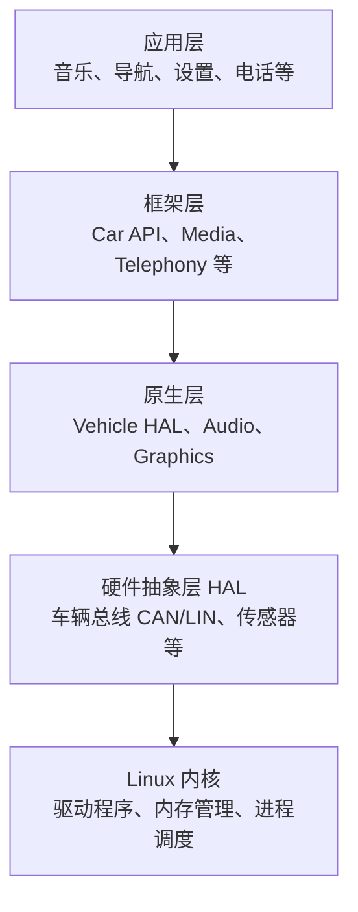

# Android IVI 开发 Part 2：Android Automotive OS 与 IVI 架构

## 前言

在 Part 1 中，我们搭建了开发环境并学习了 Kotlin 基础。现在，让我们深入 Android Automotive OS 的世界，理解它的架构和 IVI 开发的核心概念。

**本章目标**

- 理解 Android Automotive OS 与手机 Android 的区别
- 掌握 IVI 核心概念和设计原则
- 学会使用 Car API 读取车辆信息
- 创建 IVI 项目模板

## 1. Android Automotive OS 概述

### 1.1 与 Android 手机的区别

| 特性 | Android 手机 | Android Automotive OS |
|------|-------------|----------------------|
| 运行环境 | 手机/平板 | 车载系统 |
| 输入方式 | 触摸、手势 | 触摸、旋钮、方向盘按键 |
| 屏幕尺寸 | 5-7英寸 | 8-15英寸 |
| 使用场景 | 随时使用 | 驾驶中使用 |
| 安全要求 | 一般 | 高（驾驶安全） |
| 电源管理 | 电池 | 车载电源 |

### 1.2 车载系统架构



**关键组件**

- **Vehicle HAL**: 硬件抽象层，负责与车辆总线通信
- **Car Service**: 系统服务，提供车辆状态信息
- **Car API**: 应用层接口，开发者通过它访问车辆功能

> 🤖 **AI 辅助开发 Tip**
>
> **AI 辅助方式**：将官方架构文档的 URL 或关键段落提供给 AI（如 Claude Code 的 `@url` 功能或网页抓取能力），直接提问 "请用通俗的语言解释 Vehicle HAL 和 Car Service 的区别，以及它们在车载系统启动时的交互顺序"。AI 会用类比（如 "HAL 是翻译官，Car Service 是信息中枢"）帮助你快速建立直觉。遇到复杂的权限模型时，让 AI "生成一张表格对比所有车载权限的危险级别和使用场景"，比逐行阅读 XML 声明高效得多。
>
> **进阶技巧**：向 AI 描述你的车载应用需求（如 "需要读取车速和油量信息"），让它帮你梳理需要申请哪些权限、在哪些生命周期阶段初始化 Car API、以及如何处理权限被拒绝的降级方案。AI 会生成完整的权限申请流程图和代码框架，大幅缩短调研时间。

### 1.3 安全与权限模型

车载应用有严格的权限控制：

```xml
<!-- AndroidManifest.xml -->
<uses-permission android:name="android.car.permission.CAR_SPEED" />
<uses-permission android:name="android.car.permission.CAR_ENERGY" />
```

**重要权限**

| 权限 | 说明 | 危险级别 |
|------|------|---------|
| `CAR_SPEED` | 读取车速 | 危险 |
| `CAR_ENERGY` | 读取能耗 | 危险 |
| `CAR_INFO` | 读取车辆信息 | 正常 |
| `CAR_EXTERIOR_ENVIRONMENT` | 外部环境 | 危险 |

## 2. IVI 核心概念

### 2.1 车载 UI 设计原则

**驾驶安全优先**

- 减少视觉干扰：避免动画和闪烁
- 大字体大按钮：便于快速识别和点击
- 高对比度：确保阳光下可读
- 语音交互：支持语音控制减少手动操作

**代码示例：大按钮样式**

```kotlin
@Composable
fun CarButton(
    text: String,
    onClick: () -> Unit,
    modifier: Modifier = Modifier
) {
    Button(
        onClick = onClick,
        modifier = modifier
            .height(80.dp) // 大高度
            .fillMaxWidth(),
        shape = RoundedCornerShape(12.dp)
    ) {
        Text(
            text = text,
            fontSize = 24.sp, // 大字体
            fontWeight = FontWeight.Bold
        )
    }
}
```

### 2.2 车载应用生命周期

车载应用的生命周期与手机应用类似，但有额外限制：

```kotlin
class CarMediaActivity : AppCompatActivity() {
    
    override fun onCreate(savedInstanceState: Bundle?) {
        super.onCreate(savedInstanceState)
        // 初始化 UI
    }
    
    override fun onResume() {
        super.onResume()
        // 检查驾驶状态
        if (isDriving()) {
            // 限制某些操作
            disableDistractionFeatures()
        }
    }
    
    override fun onPause() {
        super.onPause()
        // 保存状态
    }
    
    private fun isDriving(): Boolean {
        // 检查车辆是否行驶中
        return false
    }
    
    private fun disableDistractionFeatures() {
        // 禁用分散注意力的功能
    }
}
```

> 🤖 **AI 辅助开发 Tip**
>
> **AI 辅助方式**：在 Claude Code 中定义一套车载 UI 设计规范（如 "所有按钮高度不低于 80dp，字体不小于 24sp，触摸目标不小于 48x48dp"），然后让 AI "基于这套规范生成一个可复用的车载主题和基础组件库"。AI 会生成包含 `CarTheme`、`CarButton`、`CarText` 等封装组件的完整代码，确保整个项目的 UI 一致性。编写驾驶模式检测时，输入 "帮我写一个安全的驾驶模式检测器，要考虑速度传感器不可用、权限被拒绝、多屏幕场景等边界情况"，AI 会生成包含异常处理和降级策略的健壮代码。
>
> **进阶技巧**：让 AI 分析你的 UI 布局代码，检查是否符合驾驶安全规范。例如输入 "检查这个 Composable 在驾驶模式下是否有过多的视觉干扰元素"，AI 会识别出动画、闪烁文字、小触摸目标等潜在问题，并建议简化方案。你还可以要求 AI "为这段代码生成 Accessibility 描述"，确保视障用户也能通过语音辅助工具正常使用应用。

### 2.3 多屏幕与分屏处理

现代汽车通常有多个屏幕：仪表盘、中控屏、副驾屏。

```kotlin
// 检查当前屏幕类型
val displayManager = getSystemService(DisplayManager::class.java)
val displays = displayManager.displays

for (display in displays) {
    when (display.name) {
        "ClusterDisplay" -> setupClusterUI()
        "MainDisplay" -> setupMainUI()
        "PassengerDisplay" -> setupPassengerUI()
    }
}
```

## 3. Car API 介绍

### 3.1 获取 Car 对象

```kotlin
import android.car.Car
import android.car.hardware.CarSensorManager

class MainActivity : AppCompatActivity() {
    private var car: Car? = null
    
    override fun onCreate(savedInstanceState: Bundle?) {
        super.onCreate(savedInstanceState)
        
        // 创建 Car 对象
        car = Car.createCar(this)
    }
    
    override fun onDestroy() {
        super.onDestroy()
        car?.disconnect()
    }
}
```

### 3.2 读取车辆属性

```kotlin
// 读取车速
fun getSpeed(): Float {
    val car = Car.createCar(context)
    val sensorManager = car.getCarManager(Car.SENSOR_SERVICE) as CarSensorManager
    
    // 注册车速监听器
    sensorManager.registerListener(
        { event ->
            val speed = event.floatValues[0] // km/h
            println("当前车速: $speed km/h")
        },
        CarSensorManager.SENSOR_TYPE_CAR_SPEED,
        CarSensorManager.SENSOR_RATE_NORMAL
    )
    
    return 0f
}

// 读取油量
fun getFuelLevel(): Float {
    val car = Car.createCar(context)
    val propertyManager = car.getCarManager(Car.PROPERTY_SERVICE) as CarPropertyManager
    
    val fuelLevel = propertyManager.getFloatProperty(
        VehiclePropertyIds.EV_BATTERY_LEVEL,
        0 // 区域 ID
    )
    
    return fuelLevel
}
```

### 3.3 车载媒体控制

```kotlin
import android.media.MediaMetadata
import android.media.session.MediaController
import android.media.session.PlaybackState

class CarMediaController(context: Context) {
    private val mediaController: MediaController
    
    init {
        val mediaSessionManager = context.getSystemService(Context.MEDIA_SESSION_SERVICE) as MediaSessionManager
        val sessions = mediaSessionManager.getActiveSessions(null)
        mediaController = sessions.firstOrNull()?.let { MediaController(context, it.token) }
    }
    
    fun play() {
        mediaController?.transportControls?.play()
    }
    
    fun pause() {
        mediaController?.transportControls?.pause()
    }
    
    fun skipToNext() {
        mediaController?.transportControls?.skipToNext()
    }
    
    fun getCurrentSong(): String {
        val metadata = mediaController?.metadata
        return metadata?.getString(MediaMetadata.METADATA_KEY_TITLE) ?: "未知歌曲"
    }
}
```

> 🤖 **AI 辅助开发 Tip**
>
> **AI 辅助方式**：在 Claude Code 中描述需求 "我需要读取车速、油量和当前播放歌曲信息，请帮我封装一个统一的 Car API 管理类，要处理生命周期和异常"，AI 会生成一个遵循最佳实践的 `CarApiManager` 单例类，自动处理连接、断开、重试、权限检查等逻辑。遇到编译错误（如 `CarPropertyManager` 找不到）时，直接粘贴错误信息，AI 会指出缺少的 import 或依赖配置（如 `androidx.car:car:1.x.x`）。
>
> **进阶技巧**：让 AI "为 Car API 的调用生成单元测试，使用 Mockito 模拟 Car 对象和 SensorManager"，AI 会自动生成包含依赖注入、模拟对象创建、回调触发验证的完整测试代码。你还可以要求 AI "将这段同步获取属性的代码改为使用 Kotlin Flow 的响应式风格"，学习如何将回调式 API 包装为现代化的响应式数据流，为后续章节学习 MVVM 和 Repository 模式打下基础。

## 4. 创建 IVI 项目模板

### 4.1 项目结构

```
CarMusicPlayer/
├── app/
│   ├── src/
│   │   └── main/
│   │       ├── java/com/example/carmusic/
│   │       │   ├── MainActivity.kt
│   │       │   ├── ui/
│   │       │   │   ├── theme/
│   │       │   │   │   └── Color.kt
│   │       │   │   ├── components/
│   │       │   │   │   ├── PlayerControls.kt
│   │       │   │   │   └── SongList.kt
│   │       │   │   └── screens/
│   │       │   │       ├── HomeScreen.kt
│   │       │   │       └── PlayerScreen.kt
│   │       │   ├── data/
│   │       │   │   ├── model/
│   │       │   │   │   └── Song.kt
│   │       │   │   └── repository/
│   │       │   │       └── SongRepository.kt
│   │       │   └── viewmodel/
│   │       │       └── PlayerViewModel.kt
│   │       └── res/
│   │           ├── drawable/
│   │           ├── values/
│   │           └── xml/
│   └── build.gradle
└── build.gradle
```

### 4.2 依赖配置

```kotlin
// build.gradle.kts (Module: app)
plugins {
    id("com.android.application")
    id("org.jetbrains.kotlin.android")
}

android {
    namespace = "com.example.carmusic"
    compileSdk = 34
    
    defaultConfig {
        applicationId = "com.example.carmusic"
        minSdk = 29
        targetSdk = 34
        versionCode = 1
        versionName = "1.0"
    }
    
    buildFeatures {
        compose = true
    }
    
    composeOptions {
        kotlinCompilerExtensionVersion = "1.5.0"
    }
    
    kotlinOptions {
        jvmTarget = "1.8"
    }
}

dependencies {
    // AndroidX
    implementation("androidx.core:core-ktx:1.12.0")
    implementation("androidx.appcompat:appcompat:1.6.1")
    
    // Compose
    implementation("androidx.compose.ui:ui:1.5.0")
    implementation("androidx.compose.material3:material3:1.1.0")
    implementation("androidx.compose.ui:ui-tooling-preview:1.5.0")
    
    // Automotive
    implementation("androidx.car.app:app:1.4.0")
    
    // Lifecycle
    implementation("androidx.lifecycle:lifecycle-runtime-ktx:2.6.0")
    implementation("androidx.activity:activity-compose:1.7.0")
    
    // Testing
    testImplementation("junit:junit:4.13.2")
    androidTestImplementation("androidx.test.ext:junit:1.1.5")
}
```

## 5. 本章小结

本章我们学习了：
- ✅ Android Automotive OS 架构（HAL、Car Service、应用层）
- ✅ IVI 核心概念（驾驶安全、UI 设计原则、生命周期）
- ✅ Car API 使用（获取车辆属性、媒体控制）
- ✅ IVI 项目模板和依赖配置

**下章预告**

Part 3 将学习 Jetpack Compose Automotive，构建美观的车载 UI。

> 🤖 **AI 辅助开发 Tip**
>
> **本课回顾**：本章我们深入理解了 Android Automotive OS 的架构和 IVI 核心概念。在继续下一章之前，可以用 AI 来强化学习效果：
>
> 1. **架构问答**：将本章的架构图描述给 AI，让它出题考你（如 "如果 Vehicle HAL 层出现故障，应用层会受到什么影响？"），通过问答检验理解深度。
> 2. **代码重构**：将本章的示例代码粘贴给 AI，让它 "用更 Kotlin 风格的方式重构这段代码"，学习空安全、扩展函数、Scope 函数等进阶特性的实际应用。
> 3. **项目脚手架**：向 AI 描述 "我要创建一个支持 Car API 的 Android Automotive 项目，使用 Jetpack Compose 和 MVVM 架构"，让它生成完整的项目结构和 `build.gradle.kts` 配置，为下一章的 Compose 学习准备好干净的代码基础。
>
> **推荐 AI 工具**：本章涉及大量架构概念和 API 调用，建议使用支持多轮对话和上下文理解的 AI 工具（如 Claude Code）。你可以将整个项目的代码库作为上下文，让 AI 在理解整体架构的基础上回答具体问题。对于 Car API 的具体调用细节，GitHub Copilot 的实时代码补全能在你编写代码时提供即时帮助。

## 延伸阅读

- [Android Automotive OS 架构](https://source.android.com/docs/automotive)
- [Car API 参考](https://developer.android.com/reference/android/car/package-summary)
- [车载 UI 设计指南](https://developer.android.com/training/cars/design)
