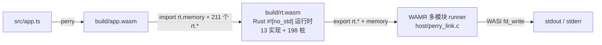

# perry 把 TypeScript 编译成了原生二进制，这对 JS 生态意味着什么

## 前言

写服务端或嵌入式程序，选语言基本是两条路。

一条走 C、C++、Rust，编出机器码，性能好，产物小。麻烦在并发上：这些语言不带异步和事件驱动，写个网络服务得自己搭事件循环（libevent、libuv）或者手写状态机；用多线程就得自己管锁、防数据竞争。并发代码对不对，全靠程序员自己保证。

另一条走 JS/TS。语言自带事件循环，`async/await` 是语法的一部分，单线程模型碰不到数据竞争，写并发比 C 省心得多。代价是性能：代码跑在解释器或 JIT 里，V8 动辄几十 MB，嵌入式设备放不下。

这里有个值得掰开的事实：JS 写并发省事，原因不在解释器，在语言语义。事件循环、Promise、`async/await` 都是语言定义的一部分，跟代码怎么执行没有关系。以前这两件事绑在一起，是因为 JS 只有一种跑法——解释器。`deno compile`、`bun build --compile`、Node 的 SEA 都没有改变这一点，它们是把解释器和代码打成一个文件，产物几十 MB，跑起来还是解释执行。AssemblyScript 能把 TS 编成 wasm，但它只支持 TS 的一个子集，完整工程用不了。

[perry](https://github.com/PerryTS/perry) 把这件事做成了：Rust 写的 TS/JS 编译器，SWC 解析、自研 HIR、LLVM 后端，产出原生可执行文件；GC、字符串、内置对象这些运行时语义由它自带的 `perry-runtime`（Rust）实现，编译时链进产物。说人话：你写的 TS 代码，编译出来就是一个普通的可执行程序，不用装 Node，不用带解释器。

工具有了，值得追问的是后面那半句：既然 JS 的并发优势来自语言语义而不是解释器，那 TS 编译成机器码之后，这些优势是不是也跟着过去了？如果能，就等于用 JS 的写法拿到了 C 的性能，还绕开了 C 里异步、多线程那套麻烦。

这篇记录一次完整实测：把 TS 编译成 wasm 业务模块，再把 perry 的 Rust 运行时也编成 wasm 模块，放进 WAMR（一个为嵌入式设计的微型 wasm 运行时）里跑。wasm 是最苛刻的形态，连宿主操作系统都没有 JS 运行时，看一份 wasm 产物能不能撑起 TS 程序。

结论先说：语言核心跑得通，性能来自编译产物这件事成立；异步、对象这些语言能力在 wasm 目标下还是空白，离"用 JS 写法替代 C"还差不少工程量。至于中间踩过的坑——装包就翻车、CLI 静默失败、一个没有文档的 ABI 怎么逆向、为什么 C 宿主路线走到一半放弃——都记录在下面。

## perry 的 wasm 输出长什么样

perry 的 wasm 后端单独发了 npm 包 [`@typerry/node`](https://github.com/fn-a/typerry)，内部链路是 SWC → HIR → wasm codegen，用 napi-rs 暴露给 JS，零运行时依赖。它产出的 wasm 是一个完整的程序：导出 `_start` 和 `memory`，程序入口在启动时把整个业务逻辑跑完。

拿到手先看结构：

```text
Export:  _start / memory / __indirect_function_table / ...
Import[211]:
 - func[0] sig=1 <rt.string_new> <- rt.string_new
 - func[1] sig=2 <rt.console_log> <- rt.console_log
 ...
```

211 个导入全挂在 `rt` 模块上：字符串、console、Math、JSON、Date、Map/Set、Buffer、crypto、fetch……perry 把整个运行时接口一次性声明进去，不管你的程序用不用。wasm 运行时实例化时要求全部导入可解析，少一个都不行，宿主必须把这 211 个函数全都提供出来，哪怕只有三个真的会被调用。

这里就是 perry 的 wasm 后端和 native 后端的根本分歧。native 后端把 `perry-runtime` 打成 `libperry_runtime.a`，由 `perry compile` 静态链接进可执行文件，运行时是产物的一部分。wasm 后端不是这样，codegen 的模块注释写得很直白：*Runtime operations (strings, console, objects) are imported from JavaScript*——运行时语义整个甩给了宿主。211 个导入贯穿了整个实测。运行时语义跟着谁走，程序就能跑到哪里，这篇文章的所有问题都从它出发。

## 先让它跑起来：装包就撞了两个坑

实测前先解决环境问题。`@typerry/node` 装到的是 0.0.3，跑不起来，报 `Cannot find module '@typerry/node-linux-x64-gnu'`。

napi-rs 的包分主包和平台包，0.0.3 的 `optionalDependencies` 点名了六个平台包（linux-x64-gnu、linux-arm64-gnu、darwin-x64、darwin-arm64、win32-x64-msvc、win32-arm64-msvc），registry 上却只有 0.0.2。主包自己是个不带 `.node` 文件的空壳。降到 0.0.2 才装上，平台包还得从 `registry.npmjs.org` 手动取 tarball（npm 镜像没同步这一层）。

判断这类问题很直接：`npm view` 主包看 `optionalDependencies`，再逐个查平台包。平台包只有 0.0.2 这件事，写这篇文章时我重新核了一遍，现在依然如此——0.0.3 的主包仍在依赖不存在的 0.0.3 平台包。

包解决之后，README 里的 CLI 用法又行不通。`typerry input.ts --bare` 执行完什么都没有：没有报错，没有文件，退出码 0。翻了 `main.js` 才发现它靠 `process.argv[1]` 和 `import.meta.url` 比对来判断自己是不是被直接执行，而 `node_modules/.bin/typerry` 是个软链，路径对不上，CLI 主体根本不会执行。绕开的办法是用库 API：

```js
import { wasmBare, wasmBoot } from '@typerry/node';
const wasm = wasmBare(source);              // 裸 wasm
const ref  = wasmBoot(source, '', true);    // wasm + perry 自带的 JS 宿主层
```

`wasmBare` 产裸 wasm 模块，`wasmBoot` 额外产一份 JS 宿主层。这份 112 KB 的宿主层，后来成了整个实测里最有价值的东西——后面会反复用到。

实测用的 TS 源码长这样，覆盖递归、循环、数字运算、字符串拼接、模板字符串、`.length`、字符串比较、`console.log`：

```ts
function fib(n: number): number {
  if (n < 2) return n;
  return fib(n - 1) + fib(n - 2);
}

function sumFib(limit: number): number {
  let total = 0;
  for (let i = 0; i < limit; i++) {
    total += fib(i);
  }
  return total;
}

function greet(name: string): string {
  return "Hello, " + name + "!";
}

const total: number = sumFib(20);
console.log("fib(0..19) sum = " + total);

const msg: string = greet("WAMR");
console.log(msg);
console.log("msg.length = " + msg.length);

if (msg === "Hello, WAMR!") {
  console.log("string compare ok");
}

console.log(`template: ${msg} (sum=${total})`);
```

这个程序刻意避开对象和数组，先把"纯原始值"这条线打通。数组留给后面的负向测试。

## 摸清 211 个导入的调用约定

真正的难点在这份宿主层要回答的问题上：211 个 `rt.*` 导入的实现约定。调用约定是 perry 内部的，没有文档，值怎么编码、字符串怎么传、返回值写在哪，靠猜不知要试多久。好在宿主层本身就是一份现成的参考实现，`buildImports()` 里那段 JS 就是这 211 个函数的精确定义。我没有去读源码反推，而是给它的 `mem_call` 插了一行打印：

```js
process.stderr.write(`MEMCALL ${name} args=${JSON.stringify(args)}\n`);
```

跑一遍，事实全有了：

```text
MEMCALL js_add args=[6764,4181]
MEMCALL js_add args=["fib(0..19) sum = ",10945]
MEMCALL console_log args=["fib(0..19) sum = 10945"]
```

一个 20 行的程序，真正用到的导入只有 `string_new`、`mem_call`、`mem_call_i32` 三个，所有动态调用（字符串相加、console 输出、`.length`）都收敛到 `mem_call` 这一个入口。其余 200 多个导入在实例化时被解析，之后不会被调用。

::: tip 提示
没有规范、但有能跑的参考实现时，插桩打印比读源码快得多。我一开始想靠读 wat 反推参数含义，盯了半小时 `i64.const 9223090561878065386` 也不知道那是什么；插一行 print 两分钟就全清楚了。
:::

读出来的约定是这样的。值编码是 NaN-boxing，f64 位模式，跨宿主边界按 i64 传：

| 值 | 位模式 |
| --- | --- |
| `undefined` / `null` / `false` / `true` | `0x7FFC…0001` ~ `0x7FFC…0004` |
| 字符串 | 高 16 位 `0x7FFF`，低 32 位是字符串表下标 |
| 对象/数组/闭包（handle） | 高 16 位 `0x7FFD`，低 32 位是 handle id |
| int32 快路径 | 高 16 位 `0x7FFE` |
| 其他 | 就是普通 double |

字符串表是隐式契约：wasm 启动时按固定顺序逐个调用 `rt.string_new(offset, len)` 注册字面量，宿主必须按同样顺序 append，下标即 id，两边计数错一位所有字符串就全乱了。动态调用协议是 `mem_call(nameId, argc, base)`：参数以 u64 槽位写在 wasm 线性内存 `base` 处，返回值也写回 `base`。为什么不直接按 f64 传参？源码没解释，我的判断是 f64 过 FFI 边界时 NaN 位模式有被规范化的风险，两边都按 u64 读写原始位模式最稳。

## 先试了 C 宿主：能跑，但成本随特性线性涨

ABI 清楚了，最直接的做法是宿主把 `rt.*` 实现一遍。我用 C 写了 13 个函数（字符串注册、拼接、比较、console、加法、真值判断、动态分派），值编码用一套宏直接照抄 perry 的 `perry-runtime/src/value.rs`：

```c
/* perry_abi.h — NaN-boxing 值编码 */
#define PERRY_TAG_UNDEFINED 0x7FFC000000000001ULL
#define PERRY_TAG_NULL      0x7FFC000000000002ULL
#define PERRY_TAG_FALSE     0x7FFC000000000003ULL
#define PERRY_TAG_TRUE      0x7FFC000000000004ULL

/* 高 16 位为 tag, 低 32 位为编号 */
#define PERRY_BOX_POINTER 0x7FFDULL   /* 对象/数组/闭包 handle */
#define PERRY_BOX_INT32   0x7FFEULL   /* int32 快路径 */
#define PERRY_BOX_STRING  0x7FFFULL   /* 字符串表下标 */
```

字符串表是核心状态。宿主侧维护一张表，每项记 UTF-8 字节指针、字节数和 UTF-16 码元数，因为 JS 的 `String.prototype.length` 数的是 UTF-16 码元，不是字节：

```c
typedef struct {
    char *bytes;        /* UTF-8, 以 NUL 结尾 */
    uint32_t len;       /* UTF-8 字节数 */
    uint32_t utf16_len; /* JS string.length: UTF-16 码元数 */
} PerryString;
```

编成共享库 `libperry_rt.so`，导出 `get_native_lib()` 返回模块名 `"rt"` 和符号表，WAMR 的 iwasm 用 `--native-lib=…` 在启动时 dlopen 进去，`NativeSymbol[]` 里的函数带上 `wasm_exec_env_t` 首参就能被 wasm 导入调用。纯计算程序能跑。

问题出在成本上。换成用数组的程序立刻报错。要把对象、原型链、闭包、GC、异步补齐，等于把 `perry-runtime` 在 C 里重写一遍，成千上万行，还得跟着上游 ABI 走。成本随程序用到的语言特性线性增长，这条路到头来是每个平台各写一遍运行时。C 宿主路线到此为止，它的产出是摸清了 `rt.*` 的完整约定：值编码、字符串表契约、动态分派，全是从官方宿主层插桩读出来的。

`rt.*` 为什么不做成 WASI，让任何 wasm 运行时都能跑？因为两者不在同一层。WASI（preview1）是系统调用级接口，`fd_write`、`clock_time_get`，形态统一成"(指针, 长度, …) → errno"，操作对象是字节缓冲和资源句柄；`rt.*` 是语言运行时的接口，字符串表、NaN-boxed 值、对象 handle store，WASI 里没有"字符串"概念，也没有堆对象和原型链。211 个导入只用到 16 种类型，绝大多数长成 `string_len: (i64) -> i64` 这样，i64 里装的是 f64 位模式，wasm 类型系统只看得到位宽看不到语义。perry 还把所有动态操作收敛进 `mem_call` 按名字查表分派，WASI 的导入是编译期定死的符号，没有"名字 → 实现"这一层。

所以分层是这样的：`rt` 是语言运行时，WASI 是系统调用，WASI 在 `rt` 的下面一层。要让产物跑到任何 WASI 运行时上，得把 `rt` 的实现也变成 wasm 的一部分。

## 把 perry 的 Rust 运行时编成 wasm 模块

想清楚这一层，方向就出来了：native 后端既然能把运行时静态链进产物，那 wasm 后端为什么不能把同一份运行时按 wasm 目标编译，跟业务模块一起分发？`perry-runtime` 本来就是 Rust 源码，代码结构里已经写明了这条路。

我照这个思路搭了 `runtime-wasm/`，一个 `#![no_std]` 的 Rust crate，620 行，编译出 `rt.wasm`。业务模块 import 它的 memory 和 211 个 `rt.*`，WAMR 的多模块机制把两个模块链接执行，宿主只剩 WASI 的 `fd_write` 写 stdout/stderr。



### 内存：同一块线性内存只能有一个定义者

第一个问题是谁的内存算数。wasm 多模块链接里，线性内存只能有一个定义者。业务模块原本自带 memory 段，`patch-app-memory.mjs` 把这段删掉，改成向运行时模块 import `rt.memory`：

```js
// 关键点: memory/table 的 import 不占函数索引空间
// 所以业务模块 code 段里的函数索引、隐式的 memory 0 引用全部不用动
```

这个"不占函数索引空间"是能这么干的前提。perry 产出的 wasm 里函数索引是编译期写死的，如果加一条 import 会让后面所有函数索引错位，整个模块就废了。memory 和 table 的 import 有自己的命名空间，不动 code 段。业务模块的 code 段一个字节不用改，只改了两处：import 段追加一条 `rt.memory`，memory 段整个删掉。

地址布局上，运行时的数据要避开业务模块的低地址区。`.cargo/config.toml` 里用 `--global-base=2097152` 把自己的 data/bss/stack 放到 2 MiB 以上，业务模块在低地址跑，两边不撞。

### 13 个真实实现 + 198 个桩

211 个导入当然不能都手写。两个生成工具分工：`gen-rt-symbols.mjs` 从业务模块的导入段读出全部 `rt.*` 名字和签名，源文件里已经实现（`rt_<名字>(`）的只登记符号，其余生成"调用即报错"的桩函数；`patch-app-memory.mjs` 处理内存。生成的桩长这样：

```rust
#[export_name = "array_new"]
pub extern "C" fn stub_array_new() -> i64 {
    not_implemented!("array_new")
}
```

桩为什么在编译期生成？wasm 链接检查的是声明，211 个导入必须全部有主，哪怕一个都不会被调用。这是我第一次实例化被 WAMR 拒绝时才弄清楚的。桩被调用时写 stderr 实名报错后 trap，绝不静默返回假数据——这是整个设计里最不能妥协的一条，否则程序会在不知道哪里悄悄算错。

13 个真实实现覆盖纯原始值这一线。名字从导出段一眼能看全：`string_new`、`console_log`、`console_warn`、`console_error`、`string_concat`、`js_add`、`string_eq`、`js_strict_eq`、`is_truthy`、`string_len`、`jsvalue_to_string`，加上动态分派入口 `mem_call`、`mem_call_i32`。每个实现都在做同一件事：把 i64 位模式解成 `V` 枚举，干活，再编码回 i64。比如 `js_add`：

```rust
#[export_name = "js_add"]
pub extern "C" fn rt_js_add(lhs: i64, rhs: i64) -> i64 {
    encode(add(decode(lhs as u64), decode(rhs as u64))) as i64
}
```

```rust
#[export_name = "mem_call"]
pub extern "C" fn rt_mem_call(name_id: f64, arg_count: f64, base: u32) -> f64 {
    let out = invoke(name_id, arg_count, base);
    unsafe {
        core::ptr::write_unaligned(mem_ptr::<u64>(base), encode(out));
    }
    0.0
}
```

`invoke` 里名字查不到就写 stderr 报错再 trap，跟桩的行为一致。

### 宿主 runner：四件事，没有一行 rt.* 实现

宿主 `perry_link.c` 的 main 只做四件事：load rt 模块、注册为 `"rt"`、给 rt 配 WASI 参数、load 业务模块并实例化执行。没有任何一行 `rt.*` 的实现：

```c
/* 1. 运行时模块先加载并注册成 "rt" —— 业务模块的 212 个导入
 *    (211 个函数 + memory) 都在加载时按这个名字解析。 */
rt = wasm_runtime_load(rt_buf, rt_size, error_buf, sizeof error_buf);
wasm_runtime_register_module("rt", rt, error_buf, sizeof error_buf);

/* 2. 运行时用 WASI 的 fd_write 打日志 (默认 stdio)。 */
wasm_runtime_set_wasi_args(rt, NULL, 0, NULL, 0, NULL, 0, NULL, 0);

app = wasm_runtime_load(app_buf, app_size, error_buf, sizeof error_buf);

/* 3. 实例化业务模块 —— WAMR 会一并实例化它依赖的 "rt" 模块
 *    并完成符号/内存链接。 */
app_inst = wasm_runtime_instantiate(app, 64 * 1024, 0, error_buf, sizeof error_buf);

/* 4. 跑入口。 */
wasm_application_execute_main(app_inst, 0, NULL);
```

WAMR 需要开 `WAMR_BUILD_MULTI_MODULE` 编译，iwasm 2.4.3 默认不开这个开关，CMake 配置里要显式打开。

### 两个链接阶段的坑

记忆最深的坑是 memory import 的 min 页数。业务模块 import 的 memory `min` 一旦超过 WAMR 对运行时模块记录的可用初始页数，实例化直接报 `failed to link import memory (rt, memory)`。实测 min=2 到 100 全部失败，patch 脚本固定 `min=1`。这个限制不来自 perry，来自 WAMR 的多模块链接实现——运行时模块导出的 memory 初始页数是链接时的硬约束。

第二个坑在 Rust 侧。Rust 1.70 起 cdylib 只导出 `pub` 的 `#[no_mangle]` 符号，`perry_rt_unimplemented` 当初没写 `pub`，从产物里消失，桩调用链接失败。补上 `pub` 就好。这类符号可见性问题在 `#![no_std]` + wasm 目标上尤其隐蔽，编译器不会给你任何警告。

## 实测：六步全过

`demo.sh` 把整个流程串成六步，每步都有明确产物和检查：

1. **依赖**：`@typerry/node`（napi 绑定）、`wasm32-unknown-unknown` target、WAMR iwasm（开 MULTI_MODULE）
2. **编译**：TypeScript → `build/app.wasm`；同一份源码走 perry 自带 JS 宿主层 → 参照输出
3. **运行时**：从业务模块导入段生成 198 个桩 → cargo build 出 `build/rt.wasm`
4. **链接**：业务模块改成 import `rt.memory`，编出宿主 runner `build/perry_link`
5. **正向**：跑，与 JS 宿主层的输出逐字节比对
6. **负向**：用数组的 TS 程序应当报"not implemented"且退出码非 0

正向结果，perry 官方 JS 宿主层（参照）和本次的 Rust 运行时模块（被测）各跑一遍，输出逐字节一致：

```text
fib(0..19) sum = 10945
Hello, WAMR!
msg.length = 12
string compare ok
template: Hello, WAMR! (sum=10945)
```

左边是 JS 宿主层的结果，右边是 Rust wasm 运行时模块在 WAMR 里的结果，`diff` 零差异。负向用一段碰数组的程序：

```ts
// 负向验证用: 这段代码会调用 `array_new` 等运行时函数,
// 而 runtime-wasm 只实现了原始值。
const xs: number[] = [1, 2, 3];
console.log(xs.length);
```

立刻报错，退出码 1，实名点出没实现的是哪个函数：

```text
Exception: bridge function 'array_new' is not implemented
execute _start: Exception: unreachable
```

产物尺寸：`app.wasm` 10650 B，patch 后 `app_link.wasm` 10658 B，`rt.wasm` 16798 B。三个文件加起来 38 KB，装下了一个能跑 fib、字符串拼接、模板字符串的 TS 程序外加它的运行时。

## 这改变了什么

回到开头那两条路。实测走完，对 perry 能改变什么，可以给出几条具体判断。

性能这一半是成立的。实测里 fib、字符串、模板字符串编译成 wasm 后在 WAMR 里跑，结果与 JS 宿主层逐字节一致，执行的是编译期生成的指令，解释器不参与。TS 代码从此多了一种执行方式：同样的语法，产物是机器码级别的 wasm。嵌入式这种以前放不下 JS 引擎的环境，现在能直接跑 TS 编译产物。

并发模型这一半，方向对但还没到。JS 的 `async/await` 写起来省事，前面说了，靠的是语言语义不是解释器；perry 编译遵循 JS 语义，写法不需要变。但本次实测只覆盖同步子集，事件循环和异步调度要在 wasm 运行时里重新实现，`perry-runtime` 的这部分移植工作还没人做。也就是说"用 JS 写法绕开 C 的异步麻烦"这个目标，逻辑上成立，工程上欠账。

分发方式变了一个样。运行时编进 wasm 之后，交付物是自包含的：`rt.wasm` 才 16 KB，跟业务模块放一起，放进任何有 WASI 的运行时就能跑。以前 JS 程序到哪都得先装一个几十 MB 的引擎，现在运行时语义就在产物里。

限制也摆在这：语言子集上，对象、数组、闭包、类、异步都在 198 个桩里；生态上，`fs`、`net`、`child_process` 这些 OS 耦合模块，wasm 目标要么等 WASI 的 socket 提案落地，要么编不进去；perry 自身还在 0.0.x，主包发了平台包没发、CLI 不报错、`rt` ABI 没文档，生产使用前这些得先解决。

总结一下：perry 把"TS 语法、机器码性能"从设想做成了可实测的工程路线，实测证明性能这一半是真的；"用 JS 的并发模型替代 C 的手工并发管理"是这件事更大的价值所在，前提是把异步语义在 wasm 目标下补齐。

## 复盘

实测里最有用的决策是拿 perry 自带的宿主层当参照：ABI 有了权威定义，行为有了可比对的基准，demo 最后那个 `diff` 也就顺理成章。逆向一个没文档的 ABI，找到一个能跑的同族实现插桩打印，比读源码快得多。

另一个收获是认识了 wasm 链接的规则：它检查声明而不是调用，211 个导入必须全部有主，198 个桩的生成器就是照这个规则写的。以及一个工程判断：同一份运行时源码，native 后端静态链、wasm 后端可以编成模块分发，两条路共享 `perry-runtime`，这意味着 wasm 目标的运行时能力天然不会落后 native 目标太多——缺的只是有人去移植。
