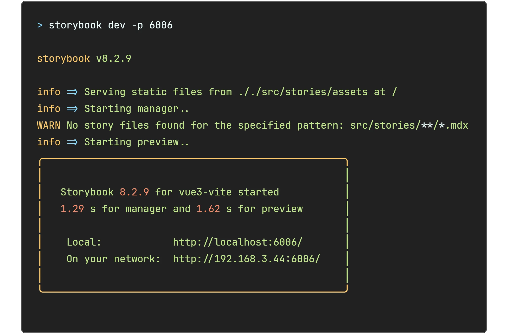
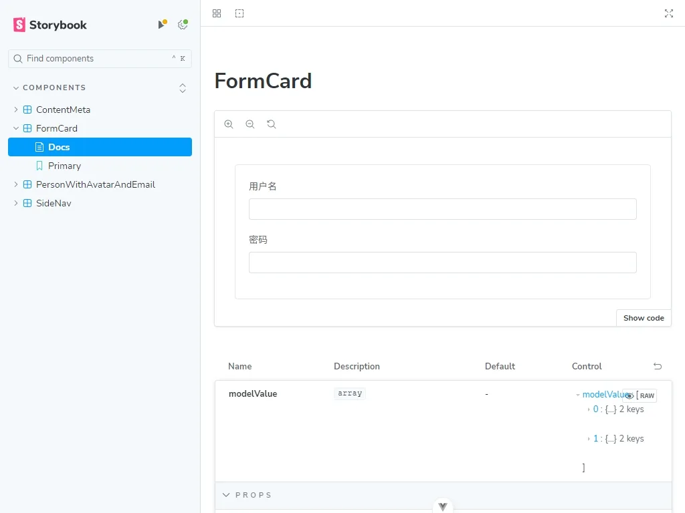

# Storybook 食用指南 Part 1 - 如何将 Storybook 集成到 Vue3 工程
<!--
注释的方法：
在正文需要注释的地方插入下面的代码，根据需要修改编号：
  <sup>[1](#note1)</sup>
在"注"章节插入对应编号的注释内容:
  <div id="note1"></div>
  [1] 这是注的内容
-->

## 前言

做组件化开发有个绕不开的麻烦：组件的开发、测试和展示往往和整个应用搅在一起，改一个按钮的状态还得把整个工程跑起来。我一直想找个工具，能把组件从应用里剥出来，单独开发和测试，最好还能顺带生成文档给团队看。试了一圈，最后落在 Storybook 上。


它给你一个独立的开发环境，插件生态够用，文档还能自动生成。这样一来，开发时精力可以全放在组件本身，不用被应用的依赖和需求拖着走。

我打算用三篇连载讲清楚它：怎么把 Storybook 集成进 Vue3 工程、怎么在里面用 Vue3 插件、怎么给 Vue3 组件写 Story。这是第一篇。

## 简介

Storybook 是一个开源工具，用来开发和测试 UI 组件，支持 React、Vue、Angular 等多种前端框架。

它的核心卖点是「独立」：组件不必挂在整个应用上就能单独开发和测试，所以开发过程更专注，效率也高。你在 Storybook 里可以查看组件在不同状态下的表现，很多潜在问题在这里就能暴露和修掉。文档能自动生成，属性和示例都带上，团队成员之间的沟通成本降了不少。

插件生态是另一块。比如 Actions 插件记录组件的交互事件，Controls 插件让你动态改组件属性。设计师、开发、测试都能在同一个界面里看和讨论组件，跨角色协作顺畅很多。视觉测试和调试也方便，能保证组件在各种情况下都正常。说到底，在 Storybook 里把组件打磨好，回到真实应用里调试的时间就少了。

## 如何将 Storybook 集成到 Vue3 工程

### 步骤 1：创建 Vue 3 项目

先创建一个新的 Vite + Vue 3 项目。已经有现成项目的，跳过这步即可。

```bash
npm create vite@latest my-vue-app
cd my-vue-app
npm install
```

### 步骤 2：安装 Storybook

进到项目目录，运行下面这条命令安装 Storybook：

```bash
npx storybook@latest init
```

跑完会在工程下生成一堆文件，下面来逐个看。

### 步骤 3：配置 Storybook

生成的 `.storybook` 目录下有个 main.js，打开它做如下配置：

```js
// main.js

const config = {
  stories: [
    "../src/stories/**/*.mdx",
    "../src/stories/**/*.stories.@(js|jsx|mjs|ts|tsx)",
  ],
  addons: [
    "@storybook/addon-onboarding",
    "@storybook/addon-links",
    "@storybook/addon-essentials",
    "@chromatic-com/storybook",
    "@storybook/addon-interactions",
  ],
  framework: {
    name: "@storybook/vue3-vite",
    options: {},
  },
};

export default config;
```

> 为了让本篇更连贯，配置的具体含义留到后续教程再细讲。

### 步骤 4：创建组件 story 文件

src 目录下会自动生成一个 stories 目录，组件的 story 就放在这里。

> **什么是组件 story？story 是组件的一个展示版，展示组件的用法和效果，就好像每个组件在讲自己的故事。**

在 src/stories 或它的子目录下创建文件，命名要叫 `xxxx.stories.js`；ts 工程则叫 `xxxx.stories.ts`。

> 本篇说明的是如何在 Vue3 的工程中集成 Storybook，如果是 React 工程，名字可以是`xxxx.stories.jsx`或者 `xxxx.stories.ts`。
>
> 关于 React 工程的 Storybook 用法，留到 React 篇再讲吧。

例如：

```text
stories
├── assets
│   └── **
├── FormCard
│   ├── FormCard.stories.js
│   ├── FormCard.constant.js
│   └── FormCard.css
└── SideNav
    ├── SideNav.stories.js
    ├── SideNav.constant.js
    └── SideNav.css
```

> **建议每个组件在 stories 目录下单独建一个目录，免得一堆 js、css 文件平铺在 stories 下，看着乱。**

打开创建好的 story 文件，填入下面的内容：

```js
import MyComponent from "@/path/to/MyComponent"; // 导入想要展示的组件

// More on how to set up stories at: https://storybook.js.org/docs/writing-stories
export default {
  title: "Components/MyComponent",
  component: MyComponent, // 导入的组件
  tags: ["autodocs"],
  argTypes: {
    // 一些 argTypes 设置
  },
  args: {
    // 一些 args 设置
  },
};

// More on writing stories with args: https://storybook.js.org/docs/writing-stories/args

// 这是一个展示的例子，可以写多个不同的名字的展示
export const Primary = {
  args: {},
};

// 这是一个展示的例子，可以写多个不同的名字的展示
export const Second = {
  args: {},
};
```

### 步骤 5：启动 Storybook

在终端运行：

```bash
npm run storybook
```

看到下面这段 log，就说明 Storybook 启动成功了。



> 如果端口被占用，按 y 会自动用下一个可用端口。

启动成功后会在本地起一个服务，URL 通常是 `http://localhost:6006`。用浏览器打开，会看到这样的画面：



到这里，工程里就已经成功集成 Storybook 了。

## 总结

本篇讲的是怎么在一个 Vite + Vue3 工程里集成 Storybook。

下一篇会接着说，怎么在 Storybook 里用工程中已有的 Vue3 插件。

<!-- ## 注 -->

<!-- 无 -->

## 参考

1. [Install Storybook](https://storybook.js.org/docs/get-started/install)
