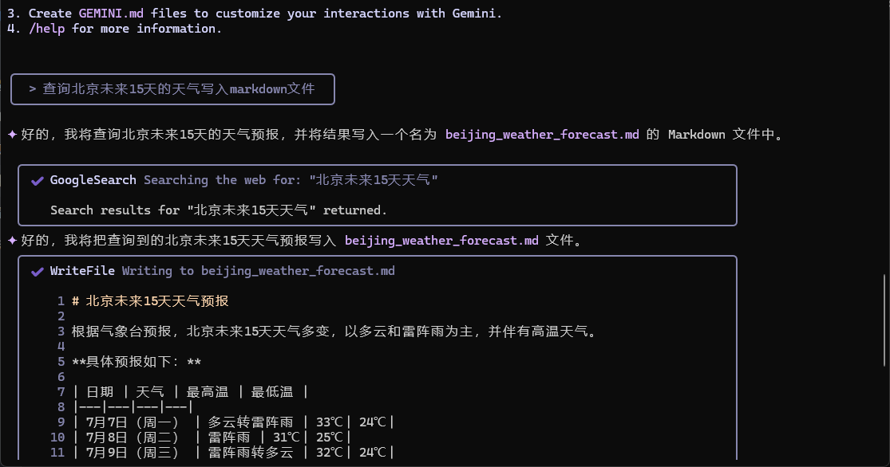

本教程将指导您如何在 Windows 操作系统上安装和使用 Google Gemini CLI。Gemini CLI 是一个命令行工具，可让您直接在终端中与 Gemini 模型进行交互。

<!-- more -->

## 目录

- [目录](#目录)
- [1. 环境准备](#1-环境准备)
  - [安装 Node.js](#安装-nodejs)
- [2. 安装 Gemini CLI](#2-安装-gemini-cli)
- [3. 登录与授权](#3-登录与授权)
  - [方式一：使用 Google 账号登录（推荐）](#方式一使用-google-账号登录推荐)
  - [方式二：使用 API 密钥（可选）](#方式二使用-api-密钥可选)
- [4. 基本使用](#4-基本使用)
- [总结](#总结)

## 1. 环境准备

在使用 Gemini CLI 之前，您需要确保您的系统可以正常访问 Google 网站，并已经安装了 Node.js 和 npm。

### 安装 Node.js

Gemini CLI 是一个 Node.js 包，因此需要先安装 Node.js 环境。

1.  **下载 Node.js**:
    访问 [Node.js 官方网站](https://nodejs.org/en/download/)。建议下载 **LTS (长期支持)** 版本的 Windows 安装包 (`.msi`)。

2.  **安装 Node.js**:
    双击下载的 `.msi` 文件，按照安装向导的提示完成安装。请确保在安装过程中勾选了 "Add to PATH" 选项，这样 `node` 和 `npm` 命令才可以在任何终端位置被识别。

3.  **验证安装**:
    安装完成后，打开您的终端（推荐使用 **Windows Terminal**，也可以使用 PowerShell 或命令提示符, 可以在开始菜单中找到这三个快捷方式），输入以下命令来验证 Node.js 和 npm 是否安装成功：

    ```bash
    node -v
    npm -v
    ```

    如果您能看到版本号输出（例如 `v20.11.0` 和 `10.2.4`），则说明安装成功。

4.  **修改 npm 源（大陆使用者需要本步骤）**

因为网络原因，为了更顺利的安装 Gemini CLI,需要修改 npm 源。

这里推荐使用 chsrc 工具

4.1. **安装 chsrc**

在终端接着输入下面的命令安装 chsrc 工具

```powershell
winget install RubyMetric.chsrc
```

等待数分钟后提示安装成功。
接着可以输入命令

```powershell
chsrc set npm
```

出现下面的画面说明 npm 换源成功了


## 2. 安装 Gemini CLI

环境准备完成您可以通过 npm 全局安装 Gemini CLI。

在终端中运行以下命令：

```bash
npm install -g @google/gemini-cli
```

`-g` 参数表示全局安装，这样您就可以在系统的任何路径下使用 `gemini` 命令。

安装完成后，可以通过以下命令验证 Gemini CLI 是否安装成功：

```bash
gemini --version
```

或者查看帮助文档：

```bash
gemini help
```

输入 gemini 可以启动 Gemini CLI 工具。此时屏幕上会显示主题选项，通过上下键选择喜欢的主题，按下`Enter`键即可。

## 3. 登录与授权

接下来的步骤需要授权。

Gemini CLI 支持两种授权方式：通过 Google 账号（OAuth 2.0）登录或使用 API 密钥。

### 方式一：使用 Google 账号登录（推荐）

这是最简单直接的方式，适合大多数个人用户。

下终端中使用上下键选择 Google 账号登录，按下回车。
此时会自动大开浏览器进入 Google 账户登录页面，按照引导登录 Google 账号即可（需要保证网络畅通），登录之后就可以使用 Gemini CLI 了。

### 方式二：使用 API 密钥（可选）

如果您在无法打开浏览器的环境（例如服务器、CI/CD 流水线）中使用，或者偏好使用 API 密钥，可以选择此方式。

1.  **获取 API 密钥**:

    访问 [Google AI Studio](https://aistudio.google.com/app/apikey) (原 MakerSuite)。登录您的 Google 账号，然后点击 "Create API key" 创建一个新的密钥。

2.  **复制 API 密钥**:

    将生成的一长串字符复制下来。请务必妥善保管此密钥，不要泄露给他人。

3.  **配置 API 密钥**:
    在 Windows 的环境变量配置中加 GEMINI_API_KEY，值是上一步得到的密钥。

## 4. 基本使用

授权完成后，您就可以开始使用 Gemini CLI 了。

在需要使用 Gemini CLI 的文件夹，按住 shift 的同时按下鼠标右键，在打开的右键菜单中选择在终端中打开。


此时在终端中打开了 Powershell 命令行工具，此时输入 Gemini


```powershell
gemini
```

此时便可以在终端中输入自然语言的指令让 Gemini 操作电脑。


例如：查询北京未来十五天的天气写入 markdown 文件。

此时 Gemini CLI 会使用搜索引擎查询天气，然后将查询结果写入文件。



此时多了一个 `beijing_weather_forecast.md` 文件

文件内容是

```markdown
# 北京未来 15 天天气预报

根据气象台预报，北京未来 15 天天气多变，以多云和雷阵雨为主，并伴有高温天气。

**具体预报如下：**

| 日期               | 天气         | 最高温 | 最低温 |
| ------------------ | ------------ | ------ | ------ |
| 7 月 7 日（周一）  | 多云转雷阵雨 | 33℃    | 24℃    |
| 7 月 8 日（周二）  | 雷阵雨       | 31℃    | 25℃    |
| 7 月 9 日（周三）  | 雷阵雨转多云 | 32℃    | 24℃    |
| 7 月 10 日（周四） | 多云         | 31℃    | 23℃    |
| 7 月 11 日（周五） | 多云         | 33℃    | 24℃    |
| 7 月 12 日（周六） | 多云         | 33℃    | 24℃    |
| 7 月 13 日（周日） | 雷阵雨转阴   | 34℃    | 25℃    |
| 7 月 14 日（周一） | 阴转雨       | 37℃    | 25℃    |
| 7 月 15 日（周二） | 多云         | 41℃    | 28℃    |
| 7 月 16 日（周三） | 阴           | 29℃    | 23℃    |
| 7 月 17 日（周四） | 小雨         | 36℃    | 23℃    |
| 7 月 18 日（周五） | 小雨         | 36℃    | 25℃    |
| 7 月 19 日（周六） | 小雨         | 38℃    | 25℃    |
| 7 月 20 日（周日） | 小雨         | 34℃    | 27℃    |

**温馨提示:**

未来几天气温较高，请注意防暑降温。雷雨天气频繁，出行请注意安全，并随身携带雨具。
```

## 总结

通过 Gemini CLI 工具，打通了 AI 电脑操作的最后一步，未来的操作系统势必是与 AI 深度结合。
人机交互从命令到图形界面最终又再次回到了命令操作，未来基于 AI 的操作系统必然是自然语言与图形界面结合的方式。
