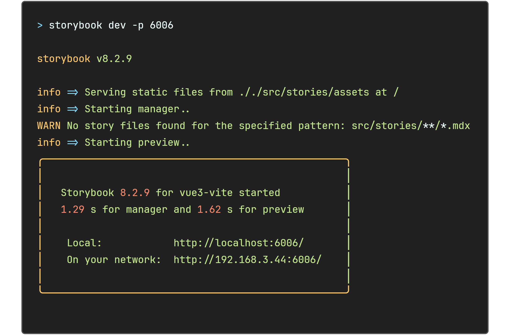

<!--
注释的方法：
在正文需要注释的地方插入下面的代码，根据需要修改编号：
  <sup>[1](#note1)</sup>
在"注"章节插入对应编号的注释内容:
  <div id="note1"></div>
  [1] 这是注的内容
-->

## 前言

在现代前端开发中，组件化开发已经成为主流，而如何高效地开发、测试和展示这些组件则是每个开发者都需要面对的挑战。项目中需要一款框架能够帮助开发者在独立环境中开发和测试组件，同时还能生成详细的文档，方便团队协作。经过一番研究和尝试，我发现了 Storybook 这款强大的工具。

<!-- more -->

Storybook 不仅提供了独立的开发环境，丰富的插件生态和自动化文档生成机制使我在开发过程中可以将精力完全集中于优化组件本身，而非应用的依赖关系和需求。

我计划用三篇连载的教程来详细讲解——如何将 Storybook 集成到 Vue3 工程、如何在 Storybook 中使用 Vue3 插件、以及如何编写 Vue3 组件的 Story。

## 简介

Storybook 是一个开源工具，用于开发和测试 UI 组件。它支持多种前端框架，包括 React、Vue 和 Angular 等。

使用 Storybook 有很多好处：

- **独立开发环境**：Storybook 允许你在不依赖整个应用程序的情况下开发和测试组件。这使得开发过程更加高效和专注。
- **组件展示**：你可以在 Storybook 中查看和测试组件在不同状态下的表现。这有助于发现和修复潜在的问题。
- **自动化文档**：Storybook 可以自动生成组件的文档，包括属性和使用示例。这使得团队成员之间的协作更加顺畅。
- **插件支持**：Storybook 有丰富的插件生态系统，可以扩展其功能。例如，Actions 插件可以帮助你记录组件的交互事件，Controls 插件可以让你动态修改组件的属性。
- **跨团队协作**：Storybook 提供了一个直观的界面，方便设计师、开发者和测试人员共同查看和讨论组件。这有助于提高团队的协作效率。
- **测试和调试**：你可以在 Storybook 中轻松地进行视觉测试和调试，确保组件在各种情况下都能正常工作。
- **提高生产力**：通过在 Storybook 中开发和测试组件，你可以减少在实际应用中调试的时间，从而提高整体开发效率。

## 如何将 Storybook 集成到 Vue3 工程

### 步骤 1：创建 Vue 3 项目

首先，创建一个新的 Vite + Vue 3 项目。如果你已经有一个现有的项目，可以跳过这一步。

```bash
npm create vite@latest my-vue-app
cd my-vue-app
npm install
```

### 步骤 2：安装 Storybook

在终端中进入你的项目的目录，运行以下命令来安装 Storybook：

```bash
npx storybook@latest init
```

运行完这个命令，会在 Storybook 下添加很多

### 步骤 3：配置 Storybook

在生成的 .storybook 目录下，你会看到一个 main.js 文件。打开它并进行以下配置：

```js
// main.js

/** @type { import('@storybook/vue3-vite').StorybookConfig } */

const config = {
  stories: [
    "../src/stories/**/*.mdx",
    "../src/stories/**/*.stories.@(js|jsx|mjs|ts|tsx)",
  ],
  addons: [
    "@storybook/addon-onboarding",
    "@storybook/addon-links",
    "@storybook/addon-essentials",
    "@chromatic-com/storybook",
    "@storybook/addon-interactions",
  ],
  framework: {
    name: "@storybook/vue3-vite",
    options: {},
  },
};

export default config;
```

> 为了让本教程更连贯，我们将留到后续教程中详细分析配置内容。

### 步骤 4：创建组件 story 文件

在 src 目录下会自动一个生成的 stories 目录，在这个目录下可以添加组件的 story。

> **什么是组件 story？story 是组件的一个展示版，展示组件的使用方式和效果，就好像每个组件在讲述自己的故事。**

在 src/stories 或者 src/stories 的子目录下创建一个文件，名字需要是 `xxxx.stories.js` ， 如果是 ts 工程那就叫`xxxx.stories.ts`。

> 本篇说明的是如何在 Vue3 的工程中集成 Storybook，如果是 React 工程，名字可以是`xxxx.stories.jsx`或者 `xxxx.stories.ts`。
>
> 关于 React 工程的 Storybook 用法，留到 React 篇再讲吧。

例如：

```text
stories
├── assets
│   └── **
├── FormCard
│   ├── FormCard.stories.js
│   ├── FormCard.constant.js
│   └── FormCard.css
└── SideNav
    ├── SideNav.stories.js
    ├── SideNav.constant.js
    └── SideNav.css
```

> **建议每个组件在 stories 目录下单独创建一个目录。这样可以避免一堆文件 js、css 文件平铺到 stories 目录下，造成视觉上的混乱。**

打开创建的 story 文件，编辑如下的内容：

```js
import MyComponent from "@/path/to/MyComponent"; // 导入想要展示的组件

// More on how to set up stories at: https://storybook.js.org/docs/writing-stories
export default {
  title: "Components/MyComponent",
  component: MyComponent, // 导入的组件
  tags: ["autodocs"],
  argTypes: {
    // 一些 argTypes 设置
  },
  args: {
    // 一些 args 设置
  },
};

// More on writing stories with args: https://storybook.js.org/docs/writing-stories/args

// 这是一个展示的例子，可以写多个不同的名字的展示
export const Primary = {
  args: {},
};

// 这是一个展示的例子，可以写多个不同的名字的展示
export const Second = {
  args: {},
};
```

### 启动 Storybook

在终端运行命令：

```bash
npm run storybook
```

看到如下 log 说明 Storybook 已经成功启动。



> 如果端口被占用，按下 y 会使用下一个可用端口

运行成功后，会在本地启动一个服务： URL 通常是`http://localhost:6006`。
使用浏览器打开 URL 中会看到这样的画面：


这就说明工程中已经成功集成了 Storybook。

### 总结

本篇教程说明了如何在一个 Vite + Vue3 的工程中集成 Storybook。

下一篇教程中将会说明如何在 Storybook 使用工程中使用的 Vue3 插件。

<!-- ## 注 -->

<!-- 无 -->

## 参考

1. [Install Storybook](https://storybook.js.org/docs/get-started/install)
